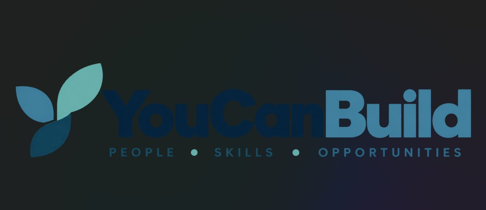

# YouCanBuild



Learn. Build. Get Guided. Prove Your Progress.

YouCanBuild helps women and young learners move from “I want to get into tech” to a structured path: a roadmap, trusted resources, mentorship when they are stuck, and verifiable proof of the milestones that matter.

## Problem

People who want to enter technology often face scattered tutorials, no clear next step, and no trustworthy way to show what they have actually learned.

## Solution

A learner chooses one technology path and follows a roadmap of modules. They can ask for structured mentorship, and major milestones can be verified on Stellar testnet without turning the product into a crypto dashboard.

## Features

- Public and signed-in layouts with mobile-friendly navigation
- Three learning paths with modules, resources, and practical tasks
- Local-first progress and achievements
- Structured mentorship (directory, requests, mentor dashboard)
- Stellar testnet verification for major achievements via Freighter

## How It Works

1. Choose a path: Frontend Development, UI/UX Design, or Web3 Development.
2. Follow the roadmap module by module (progress stays local).
3. Request guidance on a specific topic when stuck.
4. When an achievement is **Ready to verify**, optionally prove it on Stellar testnet with Freighter.

## Why Stellar

Stellar gives a learner portable proof of a milestone that someone else can check on a public explorer. The product keeps that proof limited to an anonymous achievement marker. Names, emails, ages, and locations stay off the ledger.

## Stellar Integration

**Why:** Independent, checkable proof of major milestones for portfolios and hackathon demos.

**On-chain:** A classic testnet transaction (minimum self-payment) with a short `MEMO_TEXT` marker such as `YCB:v1:html-foundations`, or a `MEMO_HASH` if the marker exceeds 28 bytes. No Soroban contract in the MVP.

**Off-chain:** Roadmap progress, module completion, mentorship requests, account email, and learner identity.

**Network:** Stellar **Testnet** only (`Networks.TESTNET`, Horizon `https://horizon-testnet.stellar.org`).

**Wallet:** [Freighter](https://www.freighter.app/) via `@stellar/freighter-api` v6 — access and signing only when the learner clicks **Verify Achievement**.

**Architecture:**

```text
src/services/stellar/
  config.ts          Public env + explorer URLs
  client.ts          Horizon load/submit/query
  wallet.ts          Freighter connect / network / sign
  achievements.ts    Marker encoding (PII-free)
  transactions.ts    Build verification transaction
  errors.ts          User-safe error mapping
  types.ts           Service types
  verifyAchievement.ts Orchestration
```

**Privacy:** Canonical marker input is `YouCanBuild|v1|<achievementId>|<pathId>`. Only the compact `YCB:v1:…` form (or its hash) is placed on-ledger.

**Verification flow:**

1. Learner completes a module → achievement earned locally (`verification.status = "ready"`).
2. Learner opens achievement detail → **Verify Achievement**.
3. Freighter connects on testnet → signs a self-payment with the marker memo.
4. App submits to Horizon → confirms success → stores `transactionHash`, `account`, `explorerUrl` locally.
5. If anything fails, the achievement stays **ready**; learning progress is never rolled back.

**Hackathon MVP uses Stellar Testnet. No real funds are required by YouCanBuild.**

## Demo Stellar Flow

1. On sign-in, use **Reset Ada demo** (optional) so HTML/CSS achievements are **Ready to verify** with no fake hashes.
2. **Continue as demo learner Ada** → **Achievements** → **HTML Foundations**.
3. Install Freighter, switch to **Testnet**, fund the account with [Friendbot](https://friendbot.stellar.org) if needed.
4. Click **Verify Achievement** → approve in Freighter.
5. Confirm **Verified on Stellar** and open **View on Stellar Explorer**.

Quick transaction sanity check (no wallet):

```bash
npm run stellar:smoke
```

## Architecture

Vite, React, and TypeScript. React Router handles screens. Tailwind CSS holds the visual system. Learning content is typed local data behind catalog functions.

```text
src/
  components/
  config/
  context/
  data/
  lib/
  pages/
  services/
    mentorship/
    stellar/
  types/
```

Application state uses React context and `localStorage`. A failed blockchain transaction must never erase learning progress.

## Tech Stack

- React 19, TypeScript (strict), Vite, React Router, Tailwind CSS 4
- `@stellar/stellar-sdk` ^17.x — Horizon, transaction build/submit
- `@stellar/freighter-api` ^6.x — browser wallet

No smart contract in the MVP.

## Getting Started

```bash
npm install
cp .env.example .env.local
npm run dev
```

Useful routes:

- `/` landing
- `/learn` Ada’s dashboard
- `/learn/achievements` milestones
- `/mentor` Amara mentor dashboard

```bash
npm run build
npm run lint
```

## Environment Variables

| Variable | Purpose |
| --- | --- |
| `VITE_STELLAR_NETWORK` | `testnet` |
| `VITE_STELLAR_HORIZON_URL` | Horizon endpoint |
| `VITE_STELLAR_RPC_URL` | Soroban RPC (reserved; unused in MVP verification) |
| `VITE_STELLAR_NETWORK_PASSPHRASE` | Must match `Networks.TESTNET` |
| `VITE_STELLAR_EXPLORER_URL` | Base URL; append `/tx/<hash>` |

Anything prefixed with `VITE_` is shipped to the browser. Never put a secret key or seed phrase in one of these variables.

## Deploy on Render (free static site)

1. In [Render](https://dashboard.render.com): **New → Blueprint** and connect this GitHub repo (uses [`render.yaml`](render.yaml)).
2. Or **New → Static Site** with **Build:** `npm ci && npm run build`, **Publish:** `dist`, and rewrite `/*` → `/index.html`.
3. Stellar `VITE_*` vars are set in `render.yaml` (public testnet defaults). No secrets required.

## Safety & Privacy

Some learners may be under 18.

- Structured mentorship without private chat
- Mentor-facing UI shows learner display name only
- Email stays on the private account record
- On-chain data is an achievement marker only

## Demo

Ada (demo learner): Frontend path, JavaScript current module, HTML/CSS achievements ready to verify after reset.

Amara (demo mentor): structured mentorship queue for hackathon walkthrough.

Sign-in card: **Reset Ada demo**, **Continue as demo learner Ada**, **Continue as demo mentor Amara**.

## Hackathon

Built for the Stellar Find Your Way Hackathon, General Track.

Demonstration arc: landing → Ada dashboard → mentorship request → **one real testnet verification** → explorer link → mentor dashboard.
